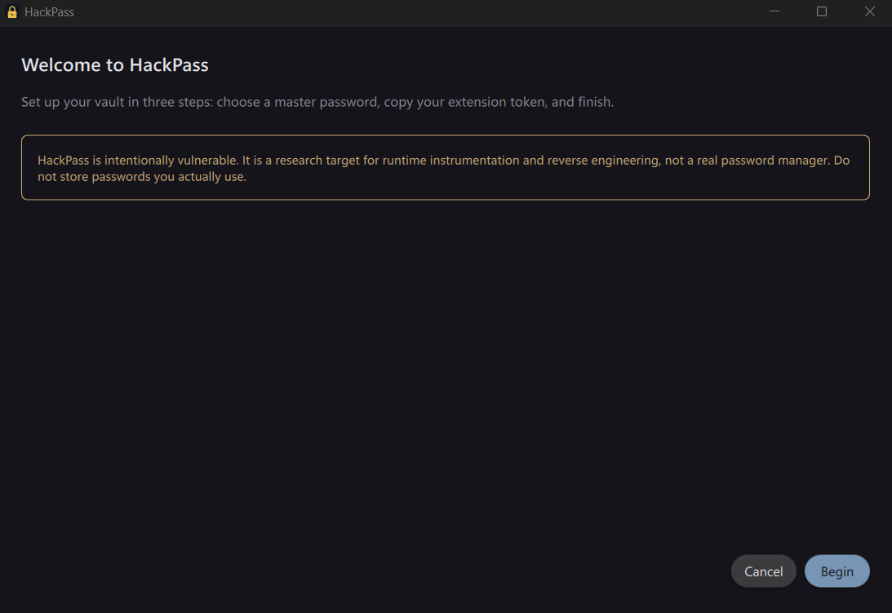
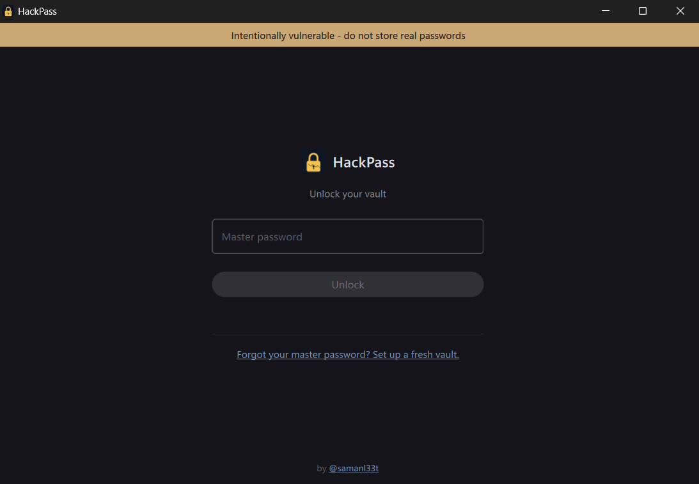
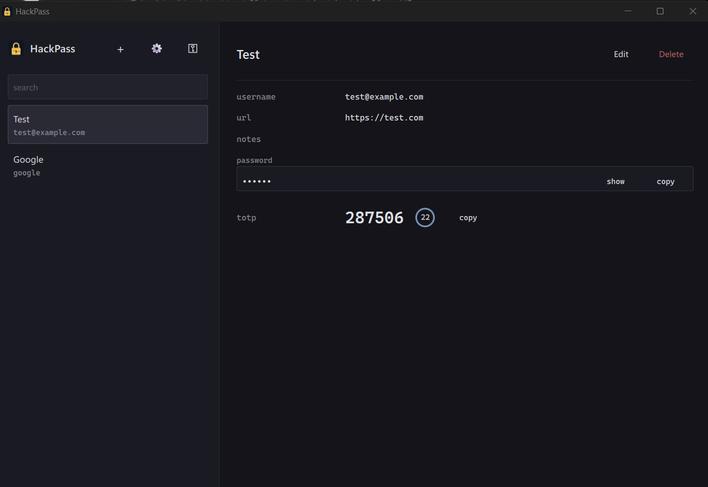
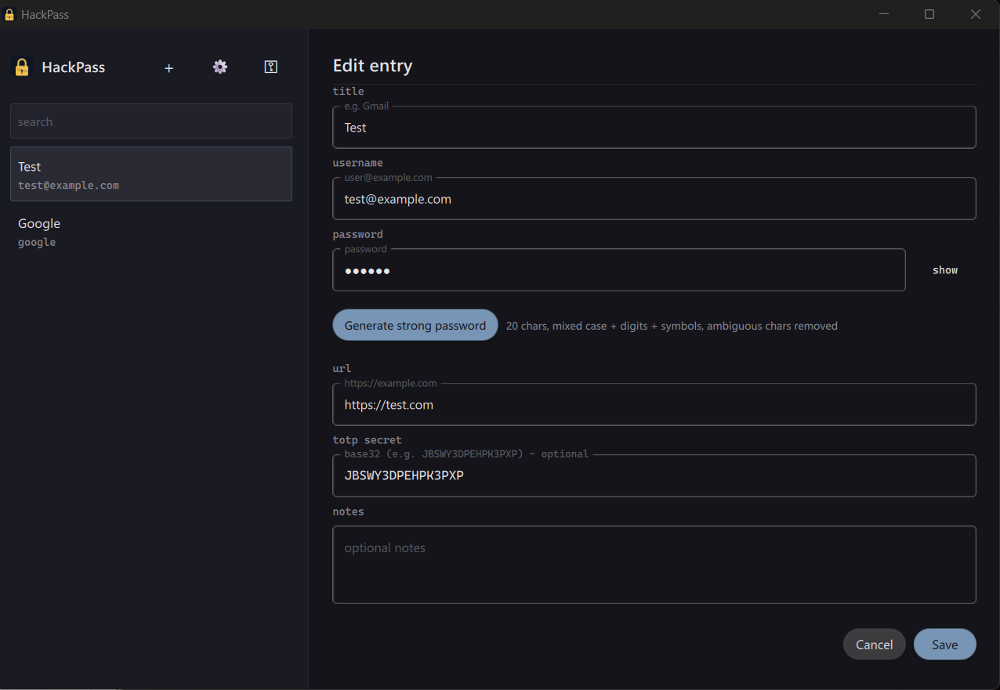
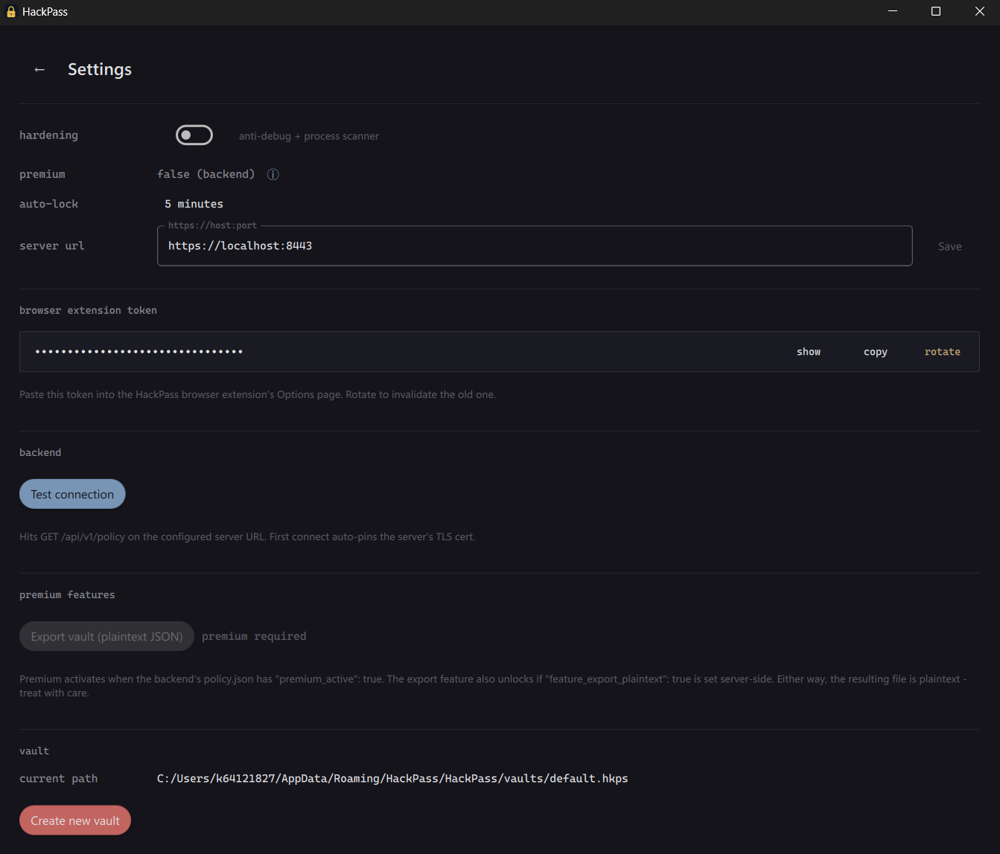
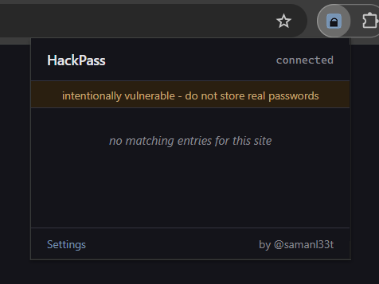
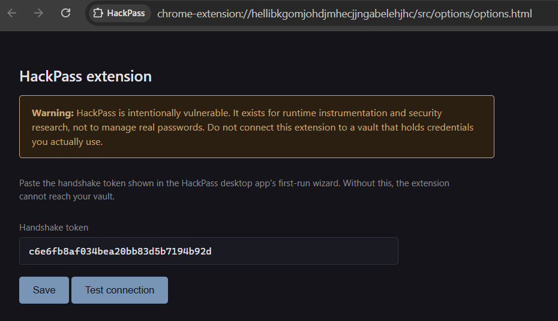

<p align="center">
  
</p>

# HackPass

A deliberately vulnerable Qt6 desktop password manager.

It looks and behaves like a real password manager (vault, browser autofill, sync, license, TOTP), but every layer has a known weakness baked in. The point is to have a realistic target for runtime instrumentation, reverse engineering, and security research.

> **Warning.** HackPass is intentionally vulnerable. It is a research target, not a password manager. Do not store real credentials in it. Do not run it on a machine where a compromise would matter. Every release contains deliberate weaknesses and the binary is unsigned; SmartScreen will warn you, and that is expected.

## Screenshots

| First-run wizard | Login | Vault |
|:---:|:---:|:---:|
|  |  |  |

| Edit entry | Settings |
|:---:|:---:|
|  |  |

| Extension popup | Extension settings |
|:---:|:---:|
|  |  |

## Layout

```
shared/      Cross-platform code
  app/         Qt6 desktop app (C++20, Material UI)
  backend/     Bun + Hono server (sync, license, policy, messages)
  extension/   Chrome MV3 extension (autofill over localhost WebSocket)
  assets/      logo, icons
  tools/       dev scripts (icon generators, license minter)
  docs/        screenshots, internal notes

windows/     Windows-specific
  setup.bat / setup.ps1     dev build
  build-release.bat         release build (zip + Inno installer)
  clean.bat                 wipe local state
  installer/                Inno Setup script + runtime launcher + DMG-equiv tooling
  platform/                 win32 implementations of IPlatform* interfaces

mac/         macOS-specific (M-series)
  setup.sh                  dev build
  build-release.sh          release build (.app + DMG)
  clean.sh                  wipe local state
  installer/                Info.plist + DMG generator + .icns
  platform/                 AppKit / libproc / sysctl implementations of IPlatform*
```

## Install

Download a release from the [Releases page](https://github.com/samanL33T/HackPass/releases).

### Windows

- **`HackPass-Setup-X.Y.Z.exe`** - installer. Adds a Start Menu shortcut that runs the launcher.
- **`HackPass-Portable-X.Y.Z.zip`** - extract anywhere, run `start_hackpass.vbs`. No admin rights needed.

The launcher picks a free localhost port, starts the bundled backend on `https://127.0.0.1:<port>`, writes the URL into the app's Settings, and opens HackPass. Subsequent launches reuse the same port. Backend data, certs, and logs live in `%LOCALAPPDATA%\HackPass` so the install folder stays read-only.

### macOS (Apple Silicon)

- **`HackPass-X.Y.Z.dmg`** - open it, drag HackPass.app to Applications, then open HackPass from there. macOS will warn that the app is unsigned (expected). Right-click → Open → Open to acknowledge the warning.

The .app bundles the backend, OpenSSL, and the extension. On first launch the app spawns the backend on a localhost port and stores data under `~/Library/Application Support/HackPass`.

### Both platforms

No Qt, OpenSSL, bun, or Node needed on the user's machine. The only external requirement is a Chromium-based browser (Chrome or Edge) to load the extension folder from the install dir / DMG.

## Build from source

### Windows (Qt 6.7+, MSVC v143, CMake 3.21+)

Qt 6.7+ online installer components to tick:
- Qt 6.X.Y → MSVC 2022 64-bit (base)
- Qt 6.X.Y → Additional Libraries → Qt WebSockets (required for extension IPC)

```cmd
windows\setup.bat
```

Builds the app via `windeployqt` and starts the backend via `bun run start`. Flags: `-SkipApp`, `-SkipBackend`, `-SkipPrereq`, `-Clean`.

Manual:

```cmd
cmake -S . -B build -DCMAKE_BUILD_TYPE=Release
cmake --build build --config Release
build\shared\app\Release\HackPass.exe
```

### macOS (Apple Silicon, Qt 6.7+, Xcode CLT, CMake 3.21+)

```sh
brew install cmake bun openssl@3 librsvg
# Qt 6.7+: install via the Qt online installer. Tick:
#   Qt 6.X.Y → macOS                              (base, required)
#   Qt 6.X.Y → Additional Libraries → Qt WebSockets  (required, used for extension IPC)
bash mac/setup.sh
```

`setup.sh` finds Qt under `~/Qt/*`, `~/<anything>/Qt/*`, `/opt/Qt/*`, or `/Applications/Qt/*`. Override with `Qt6_DIR=/path/to/Qt/X.Y.Z/macos`. Builds the .app with `macdeployqt` and starts the dev backend. Flags: `--skip-app`, `--skip-backend`, `--skip-prereq`, `--clean`.

Manual:

```sh
cmake -S . -B build -DCMAKE_BUILD_TYPE=Release
cmake --build build -j
open build/shared/app/HackPass.app
```

Extension setup is in `shared/extension/README.md`.

## Producing a release

### Windows

```cmd
windows\build-release.bat
```

Chains setup + `installer\package.ps1` (bun-compile backend, stage openssl + extension + launcher, build portable zip, run Inno Setup if available). Outputs land in `windows\installer\output\`:

- `HackPass-Setup-1.0.0.exe` - installer (only if Inno Setup 6 is installed)
- `HackPass-Portable-1.0.0.zip` - always produced

Extra prereqs:

- [bun 1.1+](https://bun.sh) (`powershell -c "irm bun.sh/install.ps1 | iex"`)
- [Inno Setup 6](https://jrsoftware.org/isdl.php) (`winget install JRSoftware.InnoSetup`) - optional

### macOS

```sh
bash mac/build-release.sh
```

Builds the .app, bun-compiles the backend for `bun-darwin-arm64`, stages the homebrew openssl@3 binary inside the bundle, ad-hoc codesigns, then packages a DMG. Output: `mac/release/HackPass-1.0.0.dmg`.

Extra prereqs: `brew install bun openssl@3 create-dmg`. `create-dmg` is optional - without it the script falls back to plain `hdiutil`. Generate the .icns once on a Mac: `bash shared/tools/generate-icns.sh`.

## Cleaning local state

Wipe per-user state so the next launch is a first-run:

```cmd
windows\clean.bat        :: HKCU\Software\HackPass + %LOCALAPPDATA%\HackPass + %APPDATA%\HackPass
```

```sh
bash mac/clean.sh        # ~/Library/Application Support/HackPass + ~/Library/Caches/HackPass + com.samanl33t.hackpass.plist
```

Neither touches the build tree, the installed app, or the loaded extension.

## First run

**Released builds.** Launch HackPass (Start Menu shortcut, `start_hackpass.vbs`, or the .app on macOS). The launcher starts the backend on a localhost port, shows the extension load instructions, then runs the first-run wizard that asks for a master password and shows the extension handshake token.

**Source builds.** `setup` scripts run the backend via bun on `https://localhost:8443` and align the app's saved server URL to that port. Open the built binary directly. Load the extension: `chrome://extensions` → Developer mode → Load unpacked → `shared/extension/`. Paste the handshake token (from the wizard or Settings) into the extension's Options page.

Default sample vault password: `hackpass`.

## Research

Once HackPass is running, attach your debugger / instrumentation tool of choice and explore. Anti-debug hardening is off by default; you can flip it on from Settings to give yourself something to bypass.

To toggle server-driven features (premium, plaintext export, forced relock, policy messages, device revoke), edit `policy.json`:

- Windows: `windows\installer\switchpremium.bat` (opens `%LOCALAPPDATA%\HackPass\backend-data\policy.json` in Notepad)
- macOS: `bash mac/switchpremium.sh` (opens `~/Library/Application Support/HackPass/backend-data/policy.json` in the default editor)

The backend re-reads it on the next launch.

## Known Vulnerabilities

Every release contains the weaknesses below. Each is hookable, observable, or directly exploitable.

| #  | Scope              | Vulnerability                                                                |
|----|-------------------|------------------------------------------------------------------------------|
| 1  | Crypto / KDF      | Master password held in process memory across the KDF call                   |
| 2  | Crypto / KDF      | Vault decryption returns plaintext at a hookable boundary                    |
| 3  | Crypto / KDF      | KDF parameters tamperable from the vault file header (downgrade attack)      |
| 4  | Crypto / KDF      | XOR "encryption" of the sync token with a hardcoded ASCII key                |
| 5  | Crypto / KDF      | License HMAC key embedded in `.rdata`, recoverable with `strings`            |
| 6  | TLS pinning       | `sslErrors` slot hookable to silently ignore handshake failures              |
| 7  | TLS pinning       | TOFU auto-pin on first connect, no user confirmation                         |
| 8  | TLS pinning       | TOFU fingerprint store world-readable under `HKCU\Software\HackPass\tofu`    |
| 9  | IPC / extension   | Origin check is a substring match for `chrome-extension://`                  |
| 10 | IPC / extension   | Token handshake compares only the first 16 hex chars of a 32-char token      |
| 11 | IPC / extension   | Extension token stored plaintext under `HKCU\Software\HackPass\extension`    |
| 12 | IPC / extension   | Token comparison via `QString::operator==` (not constant-time)               |
| 13 | QML / C++ bridge  | `SettingsBridge` exposes 14 `Q_INVOKABLE` methods: 4 real attack vectors mixed with 10 decoy / noise methods |
| 14 | QML / C++ bridge  | `PremiumGate::isPremium` is a single bool, callable from any QML context     |
| 15 | QML / C++ bridge  | `ServerFlagsApplier::apply` accepts any `QVariantMap` from QML JavaScript    |
| 16 | Storage at-rest   | `QSettings` writes server URL, theme, hardening flag plaintext to registry   |
| 17 | Storage at-rest   | Password history retained in plaintext after rotation                        |
| 18 | Storage at-rest   | Old vault renamed to `.bak` (not wiped) on "Create new vault"                |
| 19 | Storage at-rest   | Premium-gated vault export writes everything to disk as plaintext JSON       |
| 20 | Hardening         | Anti-debug uses standard Windows API entry points, individually hookable     |
| 21 | Hardening         | 5 inline `checkAtCallsite` points share one function: single hook defeats all |
| 22 | Backend trust     | Server-issued `policy_message` rendered in a master-password prompt modal    |
| 23 | Backend trust     | Server flag `force_relock_required` triggers the same modal on demand        |
| 24 | Backend trust     | Server flag `device_status: "revoked"` is wired to local vault wipe          |
| 25 | License / premium | Premium state is one bool, server-driven AND callable from the QML bridge    |
| 26 | License / premium | License HMAC expiry compared against the local system clock                  |
| 27 | Browser extension | Save-prompt banner host element is reachable from the page's JS              |
| 28 | Browser extension | Service worker caches the handshake token in plain memory after startup      |
| 29 | Build / packaging | Binaries are unsigned by design; SmartScreen warning is expected             |
| 30 | Build / packaging | No anti-tamper check on HackPass.exe itself                                  |

## Backend

When building from source, `setup` starts the backend via bun. Manual:

```sh
cd shared/backend
bun install
bun run start
```

Listens on `https://127.0.0.1:8443` with a self-signed cert generated on first boot. Cert persists in `shared/backend/data/certs/` so the app's TOFU pin survives restarts.

Released builds bundle a `bun build --compile` standalone backend binary, started by the launcher on a random `HACKPASS_PORT` per machine (loopback-only).

## License

MIT. See [LICENSE](LICENSE).

## Disclaimer

For learning, CTFs, and practicing RE + runtime instrumentation. Don't use this as a normal password manager.
